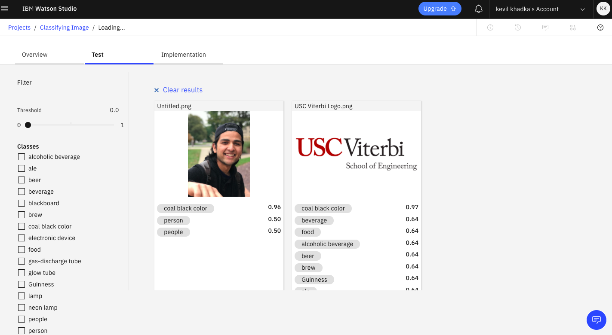

## Identifying objects in images with IBM Watson
IBM Watson Visual Recognition (VR) is a service that uses deep learning algorithms to identify objects and other content in an image. In this hands-on lab, I will use Watson VR to upload and classify images. 

### Image Classification with IBM Watson Visual Recognition:

Using IBM Watson Visual Recognition, it is a great tools to upload the images and seeing how IBM Watson identifies the various objects and faces (even gender and age) in our images.

It starts with creating a new accout with [IBM Cloud](https://cloud.ibm.com/registration). 

After creating an accout with IBM Cloud, we can able to:
- Access IBM Cloud
- Add resources to your IBM Cloud account
- Add services to your IBM Cloud account
- Create a project in Watson Studio
- Analyze images using Watson VR

Now, we are on [Dashboard](https://cloud.ibm.com/) (IBM Platform), lets create a new resource and we will choose Lite pricing plan (free) and *Watson Studio* service for this project.

Once we get into Watson studio platform, lets create a project, an empty one. Give the name and description to the project. 

Every cloud system, we may need a storage. In AWS, we create Amazon S3 Bucket, so here in IBM Cloud, it is more simpler to add storage.
Just click *Add* on right side of Define Storage. Simply go with default which means, Lite plan, and then click create and hit confirm. See, it was easy. 

Now Under Define Storage, click Refresh, then click Create.

Now we are already created a shell for our project. We need to remember what is our task here.
This project focus on analyzing images, so we need to add the Watson Visual Recognition Service. We will also need some images to analyze, so before going any further, download some images to your local drive which you want to classify. 

Now our task is to add Visual Recognition Service which we can do it from clicking Add Project from top column. Choose asset type, *Visual Recognition Service*.

In pop up Associate a service box, Click *here*. 

Now it time to analyze images with Watson VR. We can see all the built-in image classification models that IBM Watson provides! Let's try the General model. To analyze our images, on the Models page, under Prebuilt Models, in the General box, click Test.

On the General page, click the TEST tab, and upload your images which you already downloaded in your local drive. Select mulitple images you want to classify. 

Once we have uploaded our images, Watson Studio Visual Recognition will tell what it thinks it found in images! There are some filter options we can choose. Beside each class of object (or color, age, etc.), it gives a confidence score (between 0 and 1) showing how confident it is that it found that particular object or feature in our image (0 for lowest confidence and 1 for highest confidence).

My Result:    
   

FurtherMore, In check box, we can choose specific class which Watson VR has detected.

We use the Threshold slider to only display images in which Watson VR has at least 90% confidence of the beige color. 

This is it. We did it. It was not that rocket science type thing. I found IBM Machine Learning tool really simpler and easier to classify images beside coding and implementing myself.