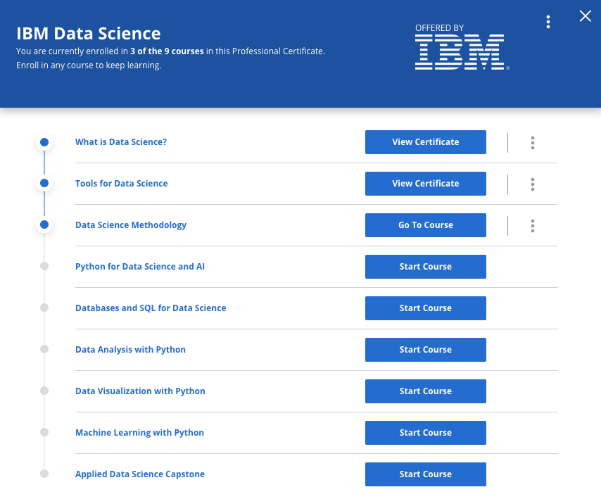

# IBM-Data Science

## Course Info:   

## Course 1: [What is Data Science?](https://github.com/kk289/IBM-Data-Science/tree/master/Course%201_What%20is%20Data%20Science%3F)       
Taught by:    
Alex Aklson, Ph.D., Data Scientist, IBM Developer Skills Network    
Polong Lin, Data Scientist, IBM Developer Skills Network    
[Certified Badge](https://www.youracclaim.com/badges/def54761-4ab0-45d8-975d-7602f464c866/public_url)

## Course 2: [Tools for Data Science](https://github.com/kk289/IBM-Data-Science/tree/master/Course%202_Tools%20for%20Data%20Science%20)    
Taught by:    
Romeo Kienzler, Chief Data Scientist, Course Lead, IBM Watson   
Svetlana Levitan, Senior Developer Advocate with IBM Center for Open Data and AI Technologies    
[Certified Badge](https://www.youracclaim.com/badges/63c76170-3246-4191-ac06-1f91590e0931/public_url)

## Course 3: [Data Science Methodology](https://github.com/kk289/IBM-Data-Science/tree/master/Course%203_Data%20Science%20Methodology)    
Taught by:    
Alex Aklson, Ph.D., Data Scientist, IBM Developer Skills Network    
Polong Lin, Data Scientist, IBM Developer Skills Network    
[Certified Badge](https://www.youracclaim.com/badges/78e09f51-d3ff-4828-89bb-3ab0693d366e/public_url)

## Course 4: [Python for Data Science and AI](https://github.com/kk289/IBM-Data-Science/tree/master/Course%204_Python%20for%20Data%20Science%20and%20AI)    
Taught by:    
Joseph Santarcangelo, Ph.D., Data Scientist at IBM, IBM Developer Skills Network    
[Certified Badge](https://www.youracclaim.com/badges/112dcf93-1ce6-49f9-af89-17c8e918adc8/public_url)

## Course 5: [Databases and SQL for Data Science](https://github.com/kk289/IBM-Data-Science/tree/master/Course%205_Databases%20and%20SQL%20for%20Data%20Science)    
Taught by:    
Rav Ahuja, AI and Data Science Program Director, IBM    
[Certified Badge](https://www.youracclaim.com/badges/7434647c-1c02-4aa2-bd02-5c7dc053d1a5/public_url)

## Course 6: [Data Analysis with Python](https://github.com/kk289/IBM-Data-Science/tree/master/Course%206_Data%20Analysis%20with%20Python)   
Taught by:    
Joseph Santarcangelo, Ph.D., Data Scientist at IBM, IBM Developer Skills Network
[Certified Badge](https://www.youracclaim.com/badges/85f1d8a8-2428-4cb9-a41c-03381d3444be/public_url)

## Course 7: [Data Visualization with Python](https://github.com/kk289/IBM-Data-Science/tree/master/Course%207_Data%20Visualization%20with%20Python)      
Taught by:    
Alex Aklson, Ph.D., Data Scientist, IBM Developer Skills Network    

